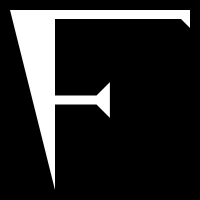

# FLeX toolchain (WIP)
<div align="center">



</div><hr>

The FLeX toolchain is a toolchain for the FLeX programming language, which includes:
 - an interpreter;
 - a compiler;
 - libraries;

# Language sample
```
"Guess the number" #print

0 10 #random-int &correct-number
$correct-number 1 #sub &guess

{

    "Guess the number" #print
    #input #string-trim #string-to-num &guess

} { $correct-number $guess #equal #not } #while

"You won!" #print
```
JavaScript pseudo-code equivalent:
```javascript
const correctNumber = randomInt(0, 10);
let guess = correctNumber - 1, i;

print("Guess the number!");

while (guess != correctNumber) {
    i = input("Guess the number");

    guess = toNumber(i.trim());

}

print("You won!");
```
